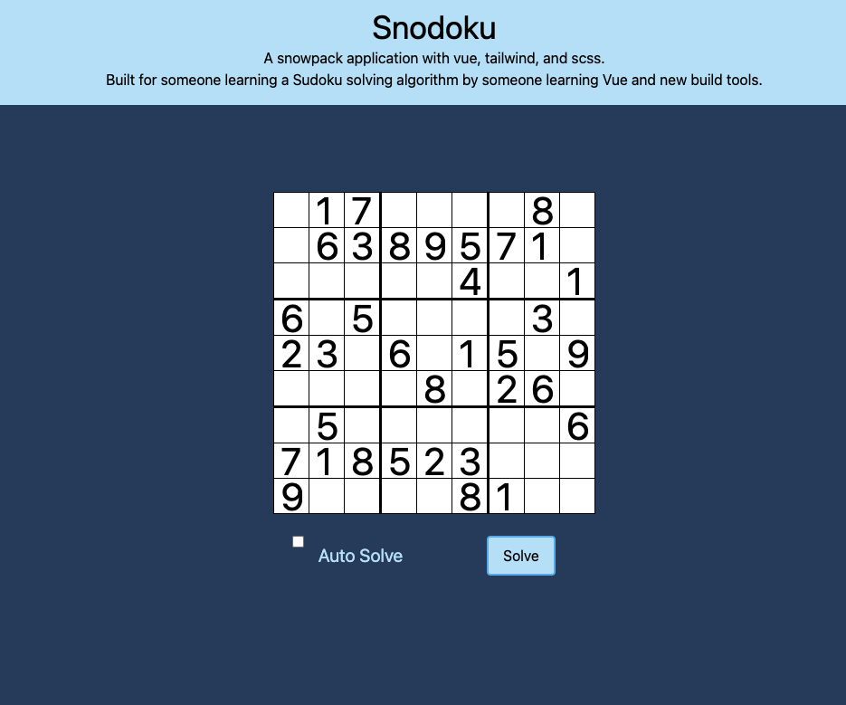

# Snodoku - A Sudoku solver built with Vue and Snowpack.

This is a snowpack application with vue, tailwind, and scss.
I built this app to learn Vue and new build tools, and left a spot for a solving algorithm to be done by a mentee. I did that part as well to provide a solution and prove that it could be done. 
> ✨ Bootstrapped with Create Snowpack App (CSA) - Vue edition.

## Available Scripts

### yarn start

Runs the app in the development mode.
Open http://localhost:8080 to view it in the browser.

The page will reload if you make edits.
You will also see any lint errors in the console.

### yarn build

Builds the app for production to the `build/` folder.
It correctly bundles Vue in production mode and optimizes the build for the best performance.
